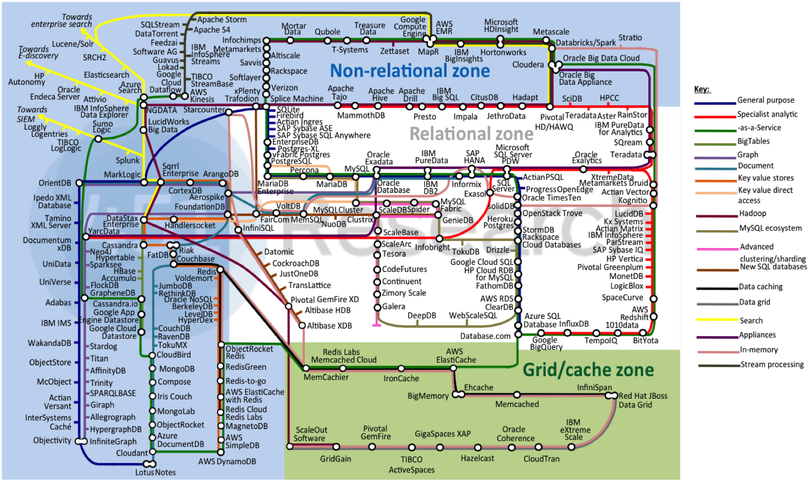

theme: Olive green, 8
footer: SURFsara, 25-10-2016
slidenumbers: true
autoscale: true

# NoSQL and MongoDB: 
### JADS Master: Data Engineering

# [fit]

---
### Today

__Part III: MongoDB__
- Data model
- Querying
- Sharding
- Caveats

---
### MongoDB is web scale

> MongoDB (from humongous) is a free and open-source cross-platform document-oriented database program. Classified as a NoSQL database program, MongoDB uses JSON-like documents with schemas. 

-- Wikipedia

---
### Data model: Document oriented
JSON Documents as data.

__Document store__:
- MongoDB

---
### Data model: Document oriented vs. Relational

---
### MongoDB CRUD
__Per collection:__

- Create documents
- Read documents
- Update documents
- Delete documents

NB: All write operations are atomic on the document level.

---
### MongoDB CRUD: Insert

---
### MongoDB CRUD: Read

---
### MongoDB CRUD: Update

---
### MongoDB CRUD: Delete

---
### Aggregations: Single purpose, pipelineing, mr

---
### Aggregations: Single purpose, pipelineing, mr

---
### Aggregations: Single purpose, pipelineing, mr

---
### High-availability

---
### Scalability

---
### Scalability

---
### Critics 

---
### Caveats
- Durability: Mongo will ack write succesful even though data might not be on disk
- Failure scenarios: stale reads or rollback of writes when an application can access two partitioned processes
- Concurrency control depends on storage engine: collection level/document level
- Queries against an index are not atomic and might miss documents being updated during the query

---
# Questions?

